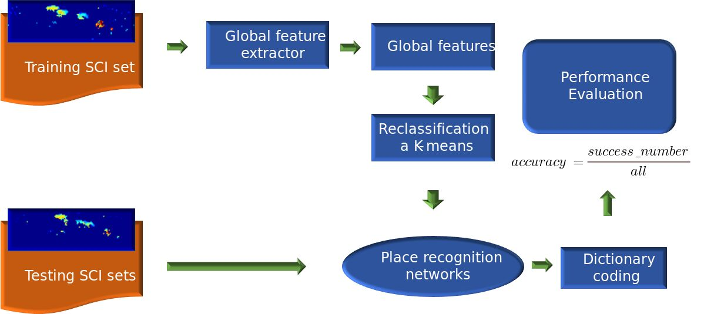

# BGF-system
Visual Place Recognition of Robots via Global Features of Scan-Context Descriptors with Dictionary-Based Coding

Ye, Minying, and Kanji Tanaka. 2023. "Visual Place Recognition of Robots via Global Features of Scan-Context Descriptors with Dictionary-Based Coding" Applied Sciences 13, no. 15: 9040. https://doi.org/10.3390/app13159040

